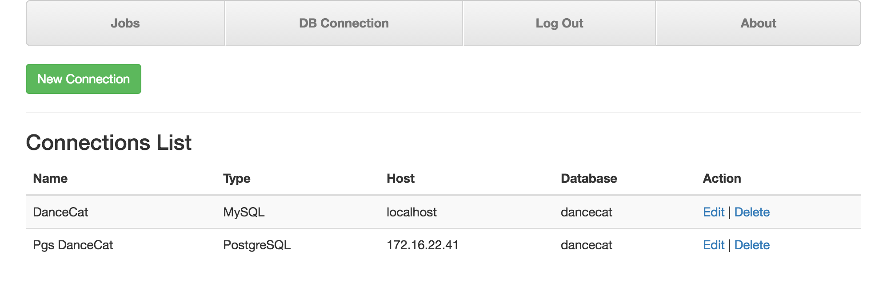
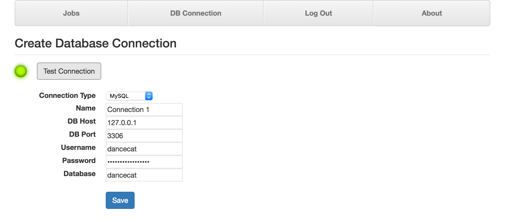

Connection Management
=====================

To be able to get data from databases, you have to provide your
databases' credentials for DanceCats. Currently DanceCats support following
RDBMS:

- MySQL
- SQL Server
- PostgreSQL

In your DanceCat site please click on the **DB Connection** tab. You will see
the list of connections, including actions (Edit, Delete):

To add a new connection, click on the **New Connection** button, to edit any connection,
click on the **Edit** link of that connection.

.. image:: _static/connections-2.png

Fill connection information into the form, click on **Test Connection** to test it,
then save it to Database by click on **Save**.

Next, once you have your own connections on DanceCats, time to create a
`new job <job_and_schedule.html#create-a-new-job>`_.
