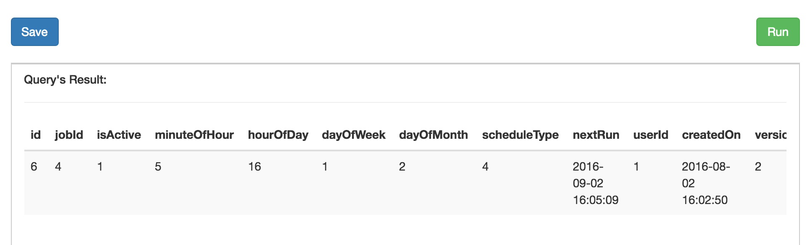
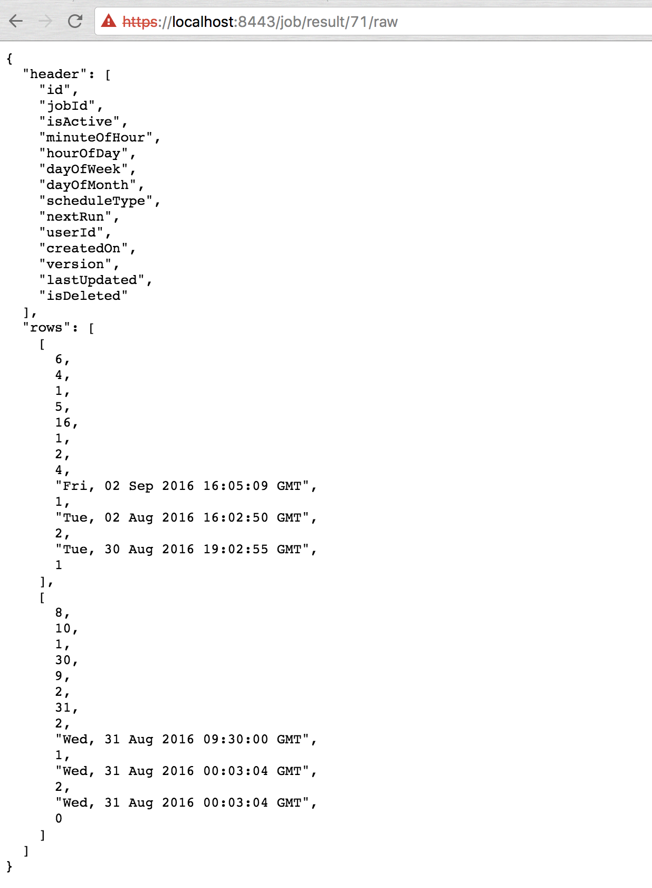
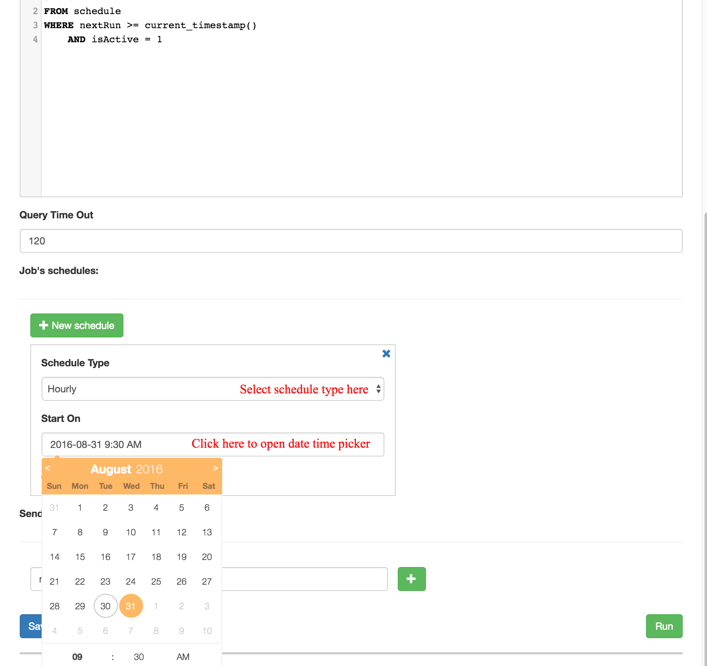
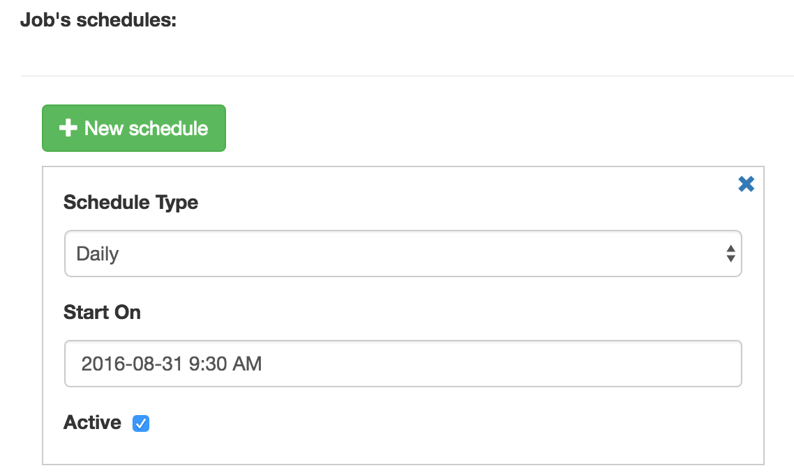

Jobs and Scheduling
===================

Create a new Job
----------------

In your DanceCat site, go to **Job** tab.

.. image:: _static/jobs-1.png

Here you will see a list of Jobs and their trackers. Firstly, add a new job by click on
**New Job** button. You will see a *Creating Job* form. Begin with filling in the
necessary information include job's name, query statement and annotation (if needed),
choose the right connection like this example:

.. image:: _static/jobs-2.png

Your job is now can be saved, but just wait a moment, try out your query by click on
**Run** button. DanceCat will start querying your statement against the chosen connection,
just for the first *100 lines*. Remember this number? You can `config <install.html#config-dancecat>`_
it by the value of *QUERY_TEST_LIMIT*.

**Note:** You won't be able to get password, secret or related data, DanceCat will detect
and get rid of them before they reach your hand.

Retrieving results
------------------

Save your new Job and return to the Job list page. On the line of your new job, click on the **Run**
link to trigger that job. You will notice that there will be a new tracker line after a short moment.
Wait for your job to finish with links to download result file in *CSV* and *XLSX* format.

- Twos in the job line which allow you to download latest result.
- Twos in the tracker lines which allow you to download that execution's result.

.. image:: _static/jobs-4.png

You can event get results in JSON format, simplify go to the URL like this example:

Finally, you can edit your jobs, add an email so that DanceCat can send you result every time that job
finish.

**Note:** Job's results have a limited time to live. After spending the given time, they will be expired
and you won't be able to retrieve them. `Config <install.html#config-dancecat>`_ this number
by setting the value of *JOB_RESULT_VALID_SECONDS*

Scheduling
----------

Scheduling allow you to run your job once, hourly, daily, weekly and monthly. With this, you don't
have to go to your DanceCat site every time you need to get reports.

To scheduling your job, go to the Jobs list page, click on **Edit** link to edit it. Next, on the Job's
editing form, click on **New schedule** button to add new schedule. Edit information that suite your needs,
then check in **Active** check box to active it. If you want to remove a schedule, just click on "X" sign
in the top-right of the schedule's form.

After finished, the schedule look like this:

Click **Save** to save your changes.

**How schedules work?**

There are a process querying the DanceCat database for every *n interval seconds*
(default n = 60) to check if there is any schedule is set to run on next n seconds. Those scheduled jobs will
be run and the schedules' next run time will be update.

**Update outdated schedules**

For some reason your DanceCat was shutdown, after restart, you need to run
following commands to update the outdated schedules:

.. code-block:: bash

   su - dancecat

   cd /opt/dancecat
   export CONFIG_FILE=/etc/dancecat/config.cfg
   python -m DanceCat.Console schedule_update
